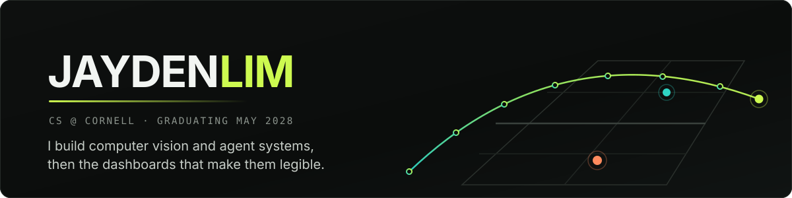
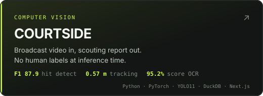
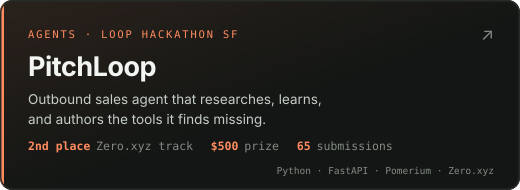
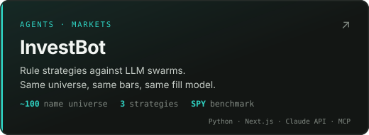
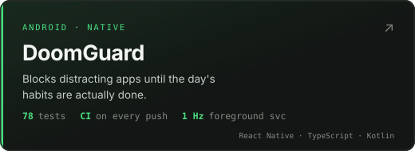
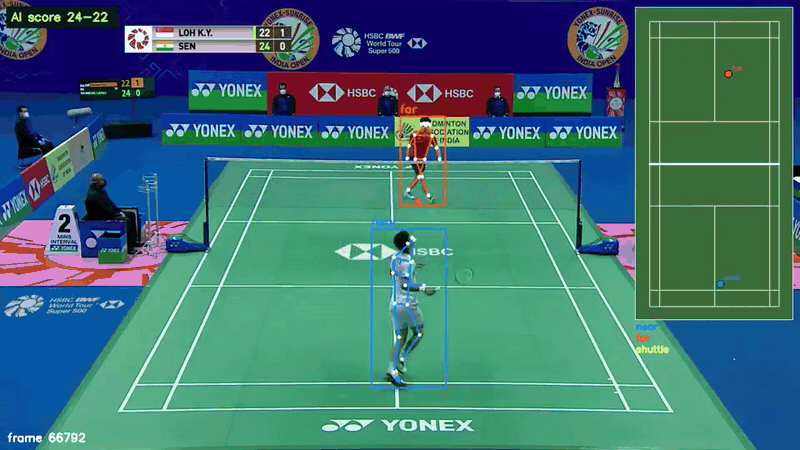
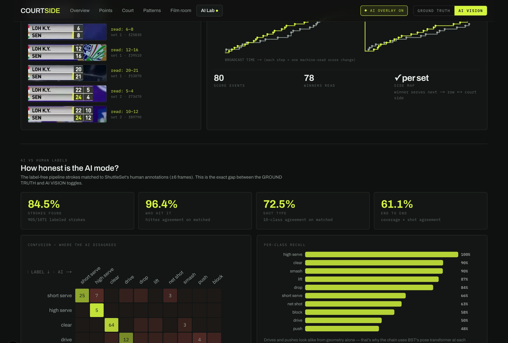
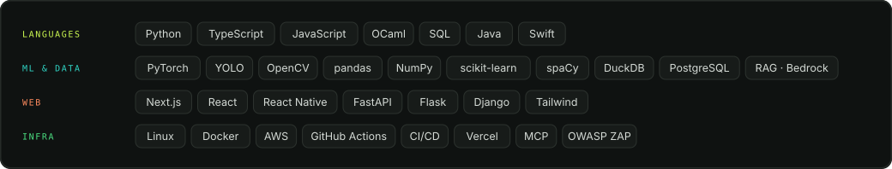

  

  
  
  

 

<table>
<tr>
<td width="50%" valign="top">
  
  
<a href="https://badminton.jaydenclim.com/"><b>↗ Live dashboard</b></a> &nbsp;·&nbsp; <a href="https://github.com/jayclim/BadmintonAI">Code</a>

</td>
<td width="50%" valign="top">
  
  
<a href="https://devpost.com/software/pitchloop"><b>↗ Devpost</b></a> &nbsp;·&nbsp; <a href="https://github.com/jayclim/pitchloop">Code</a>

</td>
</tr>
<tr>
<td width="50%" valign="top">
  
  
<a href="https://invest-bot-gray.vercel.app/"><b>↗ Live dashboard</b></a> &nbsp;·&nbsp; <a href="https://github.com/jayclim/InvestBot">Code</a>

</td>
<td width="50%" valign="top">
  
  
<a href="https://github.com/jayclim/DoomGuard"><b>↗ Code</b></a> &nbsp;·&nbsp; <a href="https://github.com/jayclim/DoomGuard#readme">Readme</a>

</td>
</tr>
</table>

 

  
  
<i><b>COURTSIDE, mid-rally.</b> Pose skeletons, the shuttle trail, the shot call with its confidence, the score read straight off the scoreboard, and a 2D replay animated from the tracks. Nothing here was labelled by hand.</i>

<b>&nbsp;How COURTSIDE scores against human annotators</b>

 

Thresholds were tuned on one match and tested untouched on a second, so the held-out column is true
out-of-distribution performance. Ground truth is ShuttleSet22.

| Stage | Tuned | Held out |
|---|---|---|
| Hit detection | **F1 87.9** | F1 85.8 |
| Rally segmentation | **F1 97.6** | F1 94.0 |
| Player → court metres | **0.57 m** median | 0.64 m |
| Landing position | **0.55 m** median | 1.12 m |
| Score OCR | **95.2%** | 97.3% |

End to end the label-free chain reproduces **84.5% / 79.5%** of annotated strokes. Player detection
and shot classification come from pretrained third-party models; hit detection, landings, rally
segmentation, score OCR and the analytics are mine. Full breakdown in the
[repo](https://github.com/jayclim/BadmintonAI#readme).

 

The AI Lab page publishes the gap between the pipeline and the human labels, per stage, rather than only the wins.

<b>&nbsp;More things I've built</b>

 

| | |
|---|---|
| **[Clash Royale Analytics](https://github.com/jayclim/CR-Data)** | Scheduled ETL that has auto-committed **1,300+** times and redeployed itself since launch, unattended. [Live ↗](https://clash.jaydenclim.com/) |
| **[OneCall](https://github.com/jayclim/onecall)** | Voice healthcare navigation. A deterministic red-flag screen runs ahead of any model call, then specialty triage over semantic retrieval. FHIR R4, real CMS provider data. |
| **[FoldEx](https://github.com/jayclim/foldex)** | Finalist (top 5), Cornell Claude Builder Club Hackathon. Async FastAPI + RQ pipeline orchestrating Claude over Ensembl, ClinVar, gnomAD and AlphaFold. [Live ↗](https://foldex-three.vercel.app/) |
| **[Veto](https://github.com/jayclim/Veto)** | MCP budget-guardrail server. Agents with receipts. |

<b>&nbsp;Where I've worked</b>

 

**Cisco** · Software Engineer Intern, Duo Security · Summer 2026 
Migrated Duo onto Cisco's internal multi-tenant incident platform as its third tenant org, designed
and owned the end-to-end incident-response pipeline replacing the outgoing third-party tool, and
built the retrieval layer of an internal SRE assistant on AWS Bedrock.

**NSF CROPPS** · Software Engineer · Mar 2026 – present 
React/Flask control dashboard for 57 networked research plants, 6 IoT device systems, live camera
feed at 15 FPS over Flask.

**CUAUV** · Software Engineer · Oct 2025 – present 
Bin-search mission logic in Python/asyncio on the team's RoboSub vehicle. 7-channel RGB + surface-normal
+ depth YOLO detector across 10 classes, ~20% detection improvement over RGB-only.

**Stanford AIMI** · Research Intern · Jun 2024 
12,549 chest X-rays, RadGraph-parsed reports. Data-level downsampling took the model from 0.56 to
**0.86 macro-AUROC** and fixed three classes that had collapsed to 0.00 F1.

<b>&nbsp;Research</b>

 

- **Multilabel Classification for Lung Disease Detection** · [arXiv:2412.11452](https://arxiv.org/abs/2412.11452) (2024)
- **A Novel Hybrid Post-Hartree-Fock and Monte Carlo Algorithm** · [IJCEA / ICCME 2025](https://doi.org/10.18178/ijcea.2025.16.1.41-47). Led an 8-person research team.

<b>&nbsp;Toolbox</b>

 

 

  Fun fact! I love badminton and I am on the Cornell Badminton team!

